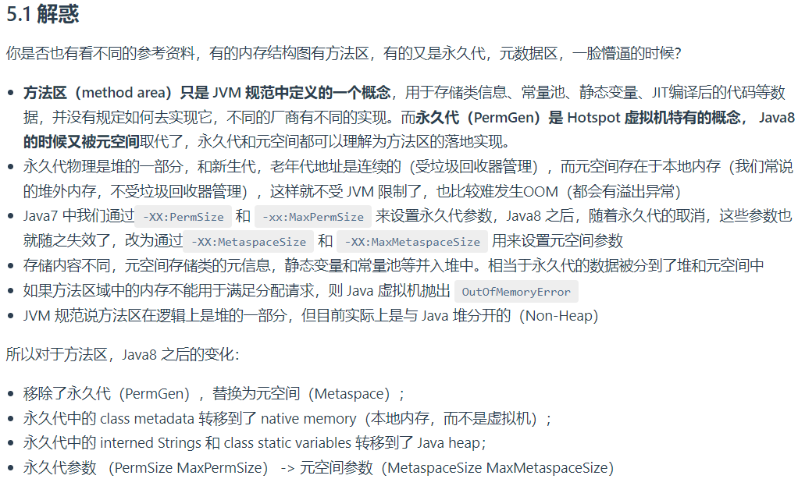

# String类

### !注意:String 类是不可改变的，所以你一旦创建了String对象，那它的值就无法改变了。如果需要对字符串做很多修改，那么应该选择使用StringBuffer & StringBuilder类。

**1. chartAt()**
* 返回指定索引处的char值

**2. compareTo()**
* 按字典顺序比较两个字符串，返回一个整数类型
* 返回的数是两个字符串第一个不相等字符的Ascii码的差值

**3. compareToIgnoreCase()**
* 按字典顺序比较两个字符串，不考虑大小写

```java
public class String_ {
    public static void main(String[] args){
        char[] char_Array = {'H', 'e', 'l', 'l', 'o', 'W', 'o', 'r', 'l', 'd'};
        String exam_String = new String(char_Array);
        System.out.println(exam_String.charAt(0));
        System.out.println(exam_String.compareTo("Hello"));
        System.out.println(exam_String.compareTo("hellohorld"));
        System.out.println(exam_String.compareToIgnoreCase("helloworld"));
    }
}
```
运行结果如下:

    H
    5
    -32
    0

**4. concat()**
* 连接两个字符串

**5. isEmpty()**
* 判断是否为空

**6. trim()**
* 返回一个忽略了首位空格的字符串

**7. length()**
* 返回字符串的长度

```java
public class String_ {
    public static void main(String[] args){
        char[] char_Array = {'H', 'e', 'l', 'l', 'o', 'W', 'o', 'r', 'l', 'd'};
        String exam_String = new String(char_Array);
        String str = " Java ";
        System.out.println(str.concat(str));
        System.out.println(exam_String.isEmpty());
        System.out.println(str.trim());
        System.out.println(str.length());
    }
}
```

运行结果如下:

    Java  Java
    false
    Java
    6

**8. copyValueOf()**
* 返回指定数组中表示该字符序列的字符串
* copyValueOf( charArray ); 使用整个输入字符数组来创建一个新的字符串对象。
* copyValueOf( charArray, 2, 6 ); 从输入字符数组的第 3 个字符（即偏移量为 2）开始，复制 6 个字符，并创建一个新的字符串对象。

```java
public class String_ {
    public static void main(String[] args){
        char[] char_Array = {'H', 'e', 'l', 'l', 'o', 'W', 'o', 'r', 'l', 'd'};
        String new_s1 = String.copyValueOf(char_Array);
        System.out.println(new_s1);
        String new_s2 = String.copyValueOf(char_Array, 2, 6);
        System.out.println(new_s2);
    }
}
```

运行结果如下:

    HelloWorld
    lloWor

**9. indexOf()**
* int indexOf(int ch)  返回指定字符在此字符串中第一次出现处的索引。
* int indexOf(int ch, int fromIndex) 从指定的索引开始搜索,返回在此字符串中第一次出现指定字符处的索引。
* int indexOf(String str) 返回指定子字符串在此字符串中第一次出现处的索引。
* int indexOf(String str, int fromIndex) 从指定的索引开始搜做, 返回指定子字符串在此字符串中第一次出现处的索引。

**10. lastIndexOf()**
* 与indexOf()类似: 反向搜索, 返回的是最后一次出现位置的索引

```java
public class String_ {
    public static void main(String[] args){
        char[] char_Array = {'H', 'e', 'l', 'l', 'o', 'W', 'o', 'r', 'l', 'd'};
        String exam_String = new String(char_Array);
        System.out.println(exam_String.indexOf('l'));
        System.out.println(exam_String.indexOf('l', 4));
        System.out.println(exam_String.indexOf("or"));
        System.out.println(exam_String.lastIndexOf('l'));
        System.out.println(exam_String.lastIndexOf('l', 7));
    }
}
```

运行结果如下:

    2
    8
    6
    8
    3

**11. toLowerCase()**
* 使用默认语言环境的规则将此 String 中的所有字符都转换为小写

**12. toUpperCase()**
* 使用默认语言环境的规则将此 String 中的所有字符都转换为大写

**13. substring()**
* 返回指定字符串的一个字串

**14. split()**
* 根据给定正则表达式的匹配拆分此字符串
* [正则表达式参考地址](https://www.runoob.com/java/java-regular-expressions.html)

```java
public class String_ {
    public static void main(String[] args) {
        char[] char_Array = {'H', 'e', 'l', 'l', 'o', 'W', 'o', 'r', 'l', 'd'};
        String exam_String = new String(char_Array);
        System.out.println(exam_String.toLowerCase());
        System.out.println(exam_String.toUpperCase());
        System.out.println(exam_String.substring(5));
        System.out.println(exam_String.substring(0, 5));
        // 拆分字符串    split(分隔符，分割的份数)
        String exam_split_s = "l-o-v-e-y-o-u";
        String[] split_str = exam_split_s.split("-", 5);
        System.out.println(Arrays.toString(split_str));
    }
}
```

运行结果如下:

    helloworld
    HELLOWORLD
    World
    Hello
    [l, o, v, e, y-o-u]

**15. replace()**
* 返回一个新的字符串，它是通过用 newChar 替换此字符串中出现的所有 oldChar 得到的

**16. toCharArray()**
* 将此字符串转换为一个新的字符数组

```java
public class String_ {
    public static void main(String[] args) {
        String s = "hello";
        System.out.println(s.replace('l', 'r'));
        char[] ca = s.toCharArray();
        for (char ch : ca){
            System.out.println(ch);
        }
    }
}
```

运行结果如下:

    herro
    h
    e
    l
    l
    o

StringBuff类方法
